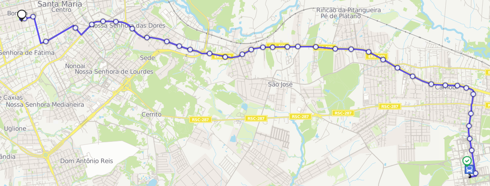

# fluxo-sumo-santa-maria

## Rota Bombeiros x UFSM by [App Moovit](https://moovitapp.com/santa_maria-4143/poi/UFSM/Parada%20Bombeiros/pt-br?tll=-29.71735_-53.71705&fll=-29.689202_-53.81529&customerId=4908&ref=7&poiType=error)

## TO DO

### Simulação

    * [ ] Extrair resultado do pandas para um arquivo CSV
    * [ ] Gerar gráficos da simulação de acordo com o resultado do pandas:
      * [ ]  com atraso nos ônibus
      * [ ]  sem atrasos nos ônibus

### Refatoração do código

    * [ ] Refatorar o código para melhorar a legibilidade
    * [ ] Refatorar o código para receber parâmetros de entrada com params
    * [ ] Formatar a chave dos ônibus para ser um valor sequêncial numérico ou acrescentar duas casas 00 na frente
