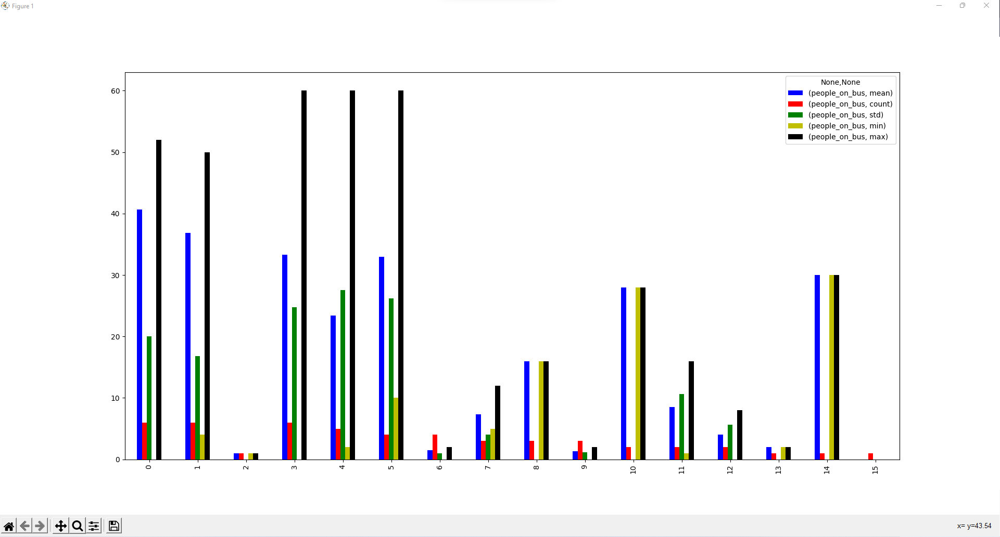
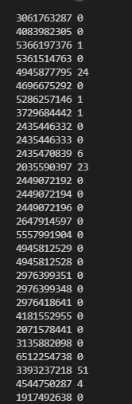

# fluxo-sumo-santa-maria

## Rota Bombeiros x UFSM by [App Moovit](https://moovitapp.com/santa_maria-4143/poi/UFSM/Parada%20Bombeiros/pt-br?tll=-29.71735_-53.71705&fll=-29.689202_-53.81529&customerId=4908&ref=7&poiType=error)

A mágica acontece aqui nesse trecho do código

    while step <= 5200:
            traci.simulationStep()
            # log de pessoas em todas as paradas a cada 10 passos
            if(step % 10 == 0):
                simulation.log_count_people_in_bus_stop(bus_stops_list)
            # a partir de 1800 passos inicio o delay em alguns onibus
            if(step > 1800):
                simulation.change_max_speed_bus(
                    speed=20.0, accel=0.1, bus_ids_delay=buses_to_delay, color=(255, 0, 0))
            # log de pessoas nos ônibus a cada 600 passos
            if(step % 600 == 0):
                simulation.get_all_people_on_simulation_buses(step)
            step += 1

### Simulação

    * [x] Extrair resultado do pandas para um arquivo CSV
    * [x] Gerar gráficos da simulação de acordo com o resultado do pandas:
      * [x]  com atraso nos ônibus
      * [x]  sem atrasos nos ônibus

 Relatório gerado a cada 600seg do número de pessoas transportadas em cada ônibus

Log da quantidade de pessoas nas paradas a cada 10 segundos

### TODO

## Informações sobre paradas de ônibus
  
    * [ ] Implementar painel para exibir em tempo real
      * [ ] Quantidade de pessoas nas paradas a cada 10seg
      * [ ] Chegada de um ônibus na parada

## Informações sobre os ônibus

    * [ ] Implementar painel para exibir em tempo real
      * [ ] Quantidade de pessoas no ônibus
      * [ ] Quantidade de pessoas que desceram e subiram nas paradas

## Tecnologias

* Python 3.8
* SUMO
* Traci
* W10 ou Ubuntu
* Pandas (lib)
* Matplotlib (lib)
  